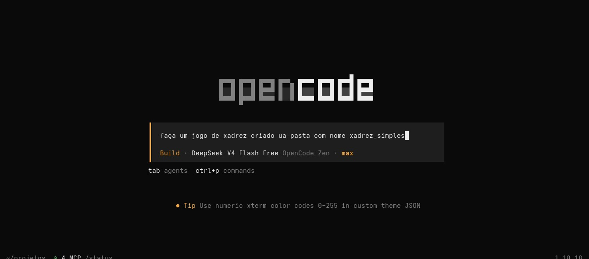

# xadrez_simples

## 1. O que o projeto faz

Jogo de xadrez para dois jogadores, 100% local, rodando no navegador (HTML/CSS/JS puro, sem dependências). Versão simples: tabuleiro com as peças, alternância de turnos entre as cores e regras básicas de movimentação.

**Opção escolhida:** projeto pessoal.

## 2. System prompt usado (completo)

```
faça um jogo de xadrez criado ua pasta com nome xadrez_simples
```

Ferramenta: OpenCode (CLI) com modelo `deepseek-v4-flash-free`.

## 3. Técnica aplicada: Nenhuma (prompt Simples)

Comando simples e curto pedindo aquilo que eu queria.

**Por que essa técnica:** Professor nos pediu para ser dessa forma curta.

<!-- EVIDÊNCIA: print da sessão mostrando o prompt de entrada e as etapas de execução (criação da pasta/arquivos, implementação e validação). -->

## 4. Teste de curadoria de contexto (arquivo inteiro vs. trecho)

<!-- EVIDÊNCIA: print da chamada A (arquivo inteiro) com contagem de tokens. -->
<!-- EVIDÊNCIA: print da chamada B (trecho) com contagem de tokens. -->

| Versão do prompt | Tokens de entrada | Tokens de saída | Total |
|---|---|---|---|
| Arquivo inteiro | 23.352 | 47.913 | 71.265 |
| Trecho | 14.924 | 4.336 | 19.260 |

## 5. Tabela de chamadas da sessão

Custo estimado simulado com a tabela de preços do DeepSeek V3 (US$ 0,27/M input, US$ 1,10/M output, US$ 0,07/M cache read), já que a ferramenta usada (OpenCode + deepseek-v4-flash-free) não cobra por chamada.

| # | Tokens de entrada | Tokens de saída | Cache read | Custo estimado |
|---|---|---|---|---|
| 1 | 13.917 | 459 | 1.792 | US$ 0,004388 |
| 2 | 309 | 245 | 15.872 | US$ 0,001464 |
| 3 | 56 | 575 | 16.384 | US$ 0,001795 |
| 4 | 133 | 2.793 | 16.896 | US$ 0,004291 |
| 5 | 125 | 111 | 19.712 | US$ 0,001536 |
| 6 | 384 | 153 | 19.712 | US$ 0,001652 |
| **Total** | **14.924** | **4.336** | **90.368** | **US$ 0,015125** |

## 6. Dashboard/log da ferramenta



## 7. URL publicada

<!-- PREENCHER: URL do deploy (Vercel/GitHub Pages) -->

Repositório: https://xadrez-simples.onrender.com

## 8. Integrantes

| Nome | RA |
|---|---|
| Eduardo Escudeiro Seifert | 23034738-2 |
| Pedro Henrique dos Santos Manfrim | 23079481-2 |
| Daniel Rodrigues Nardi | 23159251-2 |
